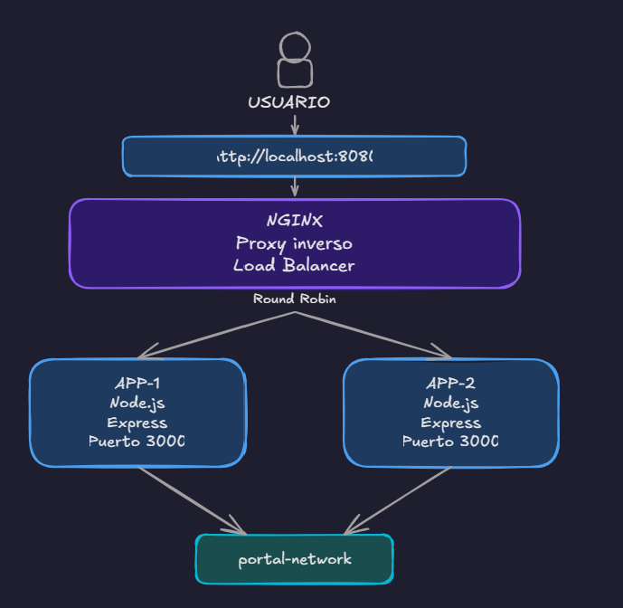

# Nexus Tech News

Portal académico de noticias tecnológicas generado o asistido mediante inteligencia artificial, contenerizado con Docker, orquestado con Docker Compose y publicado mediante NGINX como proxy inverso y balanceador de carga.

---

## 1. Descripción

**Nexus Tech News** es una aplicación web desarrollada con fines académicos que presenta seis noticias relacionadas con tecnología.

La solución utiliza dos instancias de la aplicación ejecutándose en contenedores Docker. NGINX funciona como único punto de entrada, proxy inverso y balanceador de carga, distribuyendo las solicitudes entre ambas instancias.

El contenido textual de las noticias fue generado o asistido mediante **ChatGPT de OpenAI** y revisado para fines académicos.

> **Aviso:** el contenido presentado en este portal fue generado o asistido mediante inteligencia artificial y no debe considerarse información periodística verificada.

---

## 2. Tecnologías utilizadas

### Aplicación web

- Node.js
- Express.js
- EJS
- HTML5
- CSS3

### Contenedores y orquestación

- Docker
- Docker Compose

### Proxy inverso y balanceo de carga

- NGINX

### Inteligencia artificial

- ChatGPT de OpenAI

---

## 3. Arquitectura de la solución

La solución está formada por tres servicios:

- `app1`: primera instancia de la aplicación.
- `app2`: segunda instancia de la aplicación.
- `nginx`: proxy inverso, punto de entrada y balanceador de carga.

Arquitectura general:


El usuario únicamente accede al sistema mediante NGINX.

Las instancias `APP-1` y `APP-2` permanecen dentro de la red interna de Docker y no publican directamente sus puertos hacia el sistema anfitrión.

---

## 4. Estructura del proyecto

```text
portal-noticias-ia/
|
|-- app/
|   |
|   |-- data/
|   |   `-- noticias.js
|   |
|   |-- public/
|   |   |
|   |   |-- css/
|   |   |   `-- styles.css
|   |   |
|   |   `-- images/
|   |       |-- noticia-1.jpg
|   |       |-- noticia-2.jpg
|   |       |-- noticia-3.jpg
|   |       |-- noticia-4.jpg
|   |       |-- noticia-5.jpg
|   |       `-- noticia-6.jpg
|   |
|   |-- views/
|   |   |-- 404.ejs
|   |   |-- index.ejs
|   |   `-- noticia.ejs
|   |
|   |-- .dockerignore
|   |-- .gitignore
|   |-- Dockerfile
|   |-- package-lock.json
|   |-- package.json
|   `-- server.js
|
|-- nginx/
|   `-- nginx.conf
|
|-- prompts/
|   `-- prompts.md
|
|-- docker-compose.yml
`-- README.md
```

---

## 5. Requisitos previos

Para ejecutar el proyecto se necesita:

- Docker
- Docker Compose
- Docker Desktop, en caso de utilizar Windows

Puede comprobarse la instalación mediante:

```bash
docker --version
docker compose version
```

No es necesario ejecutar Node.js directamente en el sistema anfitrión para utilizar la solución final.

---

## 6. Construcción e inicio de los contenedores

Desde la carpeta raíz del proyecto:

```text
portal-noticias-ia/
```

ejecutar:

```bash
docker compose up --build -d
```

Este comando:

1. Construye la imagen de la aplicación a partir del `Dockerfile`.
2. Crea la red interna de Docker.
3. Inicia `APP-1`.
4. Inicia `APP-2`.
5. Ejecuta los healthchecks de las aplicaciones.
6. Inicia NGINX.
7. Publica el portal mediante el puerto `8080`.

Para comprobar el estado de los servicios:

```bash
docker compose ps
```

Se deben observar los servicios:

```text
app1
app2
nginx
```

Las dos aplicaciones deben alcanzar el estado saludable.

---

## 7. Dirección para acceder al portal

El portal debe consultarse mediante:

```text
http://localhost:8080
```

NGINX es el único punto de entrada público de la solución.

Las instancias internas no deben consultarse directamente mediante puertos del sistema anfitrión.

---

## 8. Rutas configuradas

### Página principal

```text
GET /
```

Dirección:

```text
http://localhost:8080/
```

Muestra el listado de las seis noticias.

---

### Noticia individual

```text
GET /noticias/:id
```

Ejemplos:

```text
http://localhost:8080/noticias/1
http://localhost:8080/noticias/2
http://localhost:8080/noticias/3
http://localhost:8080/noticias/4
http://localhost:8080/noticias/5
http://localhost:8080/noticias/6
```

---

### Estado de la aplicación

```text
GET /health
```

Dirección:

```text
http://localhost:8080/health
```

La respuesta identifica qué instancia atendió la solicitud.

Ejemplo:

```json
{
  "status": "ok",
  "instance": "APP-1"
}
```

o:

```json
{
  "status": "ok",
  "instance": "APP-2"
}
```

---

### Página no encontrada

Las rutas inexistentes devuelven una página personalizada con estado HTTP `404`.

Ejemplos:

```text
http://localhost:8080/noticias/999
http://localhost:8080/ruta-inexistente
```

---

## 9. Dockerfile

El archivo:

```text
app/Dockerfile
```

contiene las instrucciones utilizadas para construir la imagen de la aplicación.

La imagen:

- Utiliza Node.js como entorno de ejecución.
- Instala las dependencias del proyecto.
- Copia el código fuente.
- Expone internamente el puerto `3000`.
- Ejecuta la aplicación mediante `npm start`.
- Utiliza un usuario no privilegiado para ejecutar el proceso.

Las dos instancias de la aplicación son creadas utilizando el mismo Dockerfile y el mismo código fuente.

---

## 10. Docker Compose

El archivo:

```text
docker-compose.yml
```

define los servicios:

```text
app1
app2
nginx
```

Las dos instancias utilizan el mismo código y se diferencian mediante la variable de entorno:

```text
INSTANCE_NAME
```

Valores utilizados:

```text
APP-1
APP-2
```

La aplicación utiliza esta variable para mostrar qué instancia atendió cada solicitud.

---

## 11. Red interna

Los servicios se comunican mediante la red:

```text
portal-network
```

Los servicios conectados son:

```text
app1
app2
nginx
```

Dentro de esta red, NGINX puede comunicarse con las aplicaciones utilizando sus nombres de servicio:

```text
app1:3000
app2:3000
```

No se utilizan direcciones IP estáticas.

---

## 12. Acceso a las instancias

`APP-1` y `APP-2` utilizan únicamente el puerto interno:

```text
3000
```

Estos servicios no publican sus puertos directamente hacia el host.

NGINX es el único servicio que publica un puerto:

```text
8080:80
```

Por lo tanto, el punto de acceso de la aplicación es:

```text
http://localhost:8080
```

---

## 13. Configuración de NGINX

La configuración de NGINX se encuentra en:

```text
nginx/nginx.conf
```

NGINX cumple las siguientes funciones:

- Punto de entrada del sistema.
- Proxy inverso.
- Enrutamiento de solicitudes.
- Balanceador de carga.

El grupo de servidores backend está definido mediante un `upstream` que contiene:

```text
app1:3000
app2:3000
```

Las solicitudes hacia `/`, `/noticias/` y `/health` son reenviadas a las instancias de la aplicación.

También se conservan encabezados relevantes del proxy, entre ellos:

```text
Host
X-Real-IP
X-Forwarded-For
X-Forwarded-Proto
```

NGINX agrega además:

```text
X-Proxy-By: NGINX
```

para facilitar la comprobación del paso de la solicitud a través del proxy.

---

## 14. Algoritmo de balanceo utilizado

El algoritmo utilizado es:

**Round Robin**

NGINX utiliza Round Robin de manera predeterminada cuando no se configura otro método de balanceo.

Las solicitudes son distribuidas de forma rotativa entre las dos instancias disponibles.

Ejemplo conceptual:

```text
Solicitud 1 -> APP-1
Solicitud 2 -> APP-2
Solicitud 3 -> APP-1
Solicitud 4 -> APP-2
```

Se seleccionó este algoritmo debido a que ambas instancias ejecutan la misma aplicación y poseen las mismas características.

---

## 15. Identificación de la instancia

Cada instancia posee un valor diferente de:

```text
INSTANCE_NAME
```

La aplicación permite identificar qué instancia atendió una solicitud mediante tres mecanismos.

### Interfaz del portal

El footer muestra:

```text
INSTANCIA: APP-1
```

o:

```text
INSTANCIA: APP-2
```

### Endpoint `/health`

Ejemplo:

```json
{
  "status": "ok",
  "instance": "APP-1"
}
```

### Encabezado HTTP

La aplicación agrega:

```text
X-App-Instance: APP-1
```

o:

```text
X-App-Instance: APP-2
```

---

## 16. Procedimiento para comprobar el balanceo de carga

Primero verificar que los tres servicios estén activos:

```bash
docker compose ps
```

Luego realizar varias solicitudes consecutivas al endpoint `/health`.

En PowerShell:

```powershell
1..10 | ForEach-Object {
    curl.exe -s http://localhost:8080/health
    Write-Host ""
}
```

Se deben observar respuestas atendidas por las dos instancias.

Ejemplo:

```text
{"status":"ok","instance":"APP-1"}
{"status":"ok","instance":"APP-2"}
{"status":"ok","instance":"APP-1"}
{"status":"ok","instance":"APP-2"}
```

Esto permite comprobar la distribución Round Robin.

También pueden inspeccionarse los encabezados:

```powershell
curl.exe -i http://localhost:8080/health
```

Entre ellos se espera encontrar:

```text
X-App-Instance: APP-1
```

o:

```text
X-App-Instance: APP-2
```

junto con:

```text
X-Proxy-By: NGINX
```

---

## 17. Procedimiento para comprobar la continuidad del servicio

Para detener temporalmente la primera instancia:

```bash
docker compose stop app1
```

Comprobar el estado:

```bash
docker compose ps -a
```

Mientras `APP-1` se encuentra detenida, NGINX y `APP-2` permanecen activos.

El portal debe continuar disponible mediante:

```text
http://localhost:8080
```

Para comprobar qué instancia está respondiendo:

```powershell
1..6 | ForEach-Object {
    curl.exe -s http://localhost:8080/health
    Write-Host ""
}
```

Las respuestas deben provenir de:

```text
APP-2
```

Para recuperar la instancia:

```bash
docker compose start app1
```

Después de que vuelva a estar saludable, las solicitudes deben volver a distribuirse entre `APP-1` y `APP-2`.

---

## 18. Healthchecks

`APP-1` y `APP-2` incluyen comprobaciones de salud mediante:

```text
/health
```

El objetivo es verificar que el servidor Express se encuentra disponible antes de utilizarlo normalmente como backend.

El estado puede comprobarse mediante:

```bash
docker compose ps
```

Las aplicaciones deben aparecer como:

```text
healthy
```

---

## 19. Validación de NGINX

Para comprobar que la configuración de NGINX es válida:

```bash
docker compose exec nginx nginx -t
```

La respuesta esperada debe indicar que la sintaxis es correcta y que la prueba de configuración fue exitosa.

---

## 20. Aplicación de inteligencia artificial utilizada

La herramienta utilizada para generar o asistir la redacción de las noticias fue:

**ChatGPT de OpenAI**

Cada noticia identifica claramente la herramienta utilizada y señala que el contenido fue revisado para fines académicos.

Los prompts utilizados durante la generación del contenido se encuentran documentados por separado en:

```text
prompts/prompts.md
```

Por esta razón, los prompts no se repiten dentro de este README.

---

## 21. Diseño del portal

El portal utiliza un diseño editorial adaptable inspirado en composición gráfica tipo Swiss.

Características principales:

- Fondo blanco.
- Texto negro carbón.
- Rojo escarlata como color de acento.
- Retícula editorial asimétrica.
- Titular principal destacado.
- Fotografías relacionadas con cada noticia.
- Divisiones mediante líneas.
- Diseño adaptable a computadoras, tabletas y dispositivos móviles.
- Sin gradientes.
- Sin glassmorphism.

---

## 22. Comandos principales

### Construir e iniciar toda la solución

```bash
docker compose up --build -d
```

### Ver el estado de los servicios

```bash
docker compose ps
```

### Validar NGINX

```bash
docker compose exec nginx nginx -t
```

### Comprobar balanceo

```powershell
1..10 | ForEach-Object {
    curl.exe -s http://localhost:8080/health
    Write-Host ""
}
```

### Detener APP-1

```bash
docker compose stop app1
```

### Iniciar APP-1

```bash
docker compose start app1
```

### Detener APP-2

```bash
docker compose stop app2
```

### Iniciar APP-2

```bash
docker compose start app2
```

### Ver logs

```bash
docker compose logs
```

### Apagar la solución

```bash
docker compose down
```

---

## 23. Ejecución desde cero

Para comprobar que el proyecto puede desplegarse nuevamente desde cero:

```bash
docker compose down
```

Luego:

```bash
docker compose up --build -d
```

Verificar:

```bash
docker compose ps
```

Finalmente acceder a:

```text
http://localhost:8080
```

La solución completa debe iniciarse mediante el comando:

```bash
docker compose up --build -d
```

---

## 24. Detener el proyecto

Para detener y eliminar los contenedores y la red creada por Docker Compose:

```bash
docker compose down
```

Para volver a iniciar el proyecto:

```bash
docker compose up --build -d
```

---

## 25. Resumen

Nexus Tech News implementa:

- Una aplicación web de noticias.
- Seis artículos tecnológicos.
- Contenido generado o asistido mediante ChatGPT.
- Dockerfile para la aplicación.
- Dos instancias de Express.
- Docker Compose.
- Red interna entre contenedores.
- NGINX como proxy inverso.
- Enrutamiento de solicitudes.
- Balanceo Round Robin.
- Identificación de instancias.
- Healthchecks.
- Continuidad del servicio al detener una instancia.
- Diseño responsive.

El portal debe ser consultado mediante:

```text
http://localhost:8080
```
